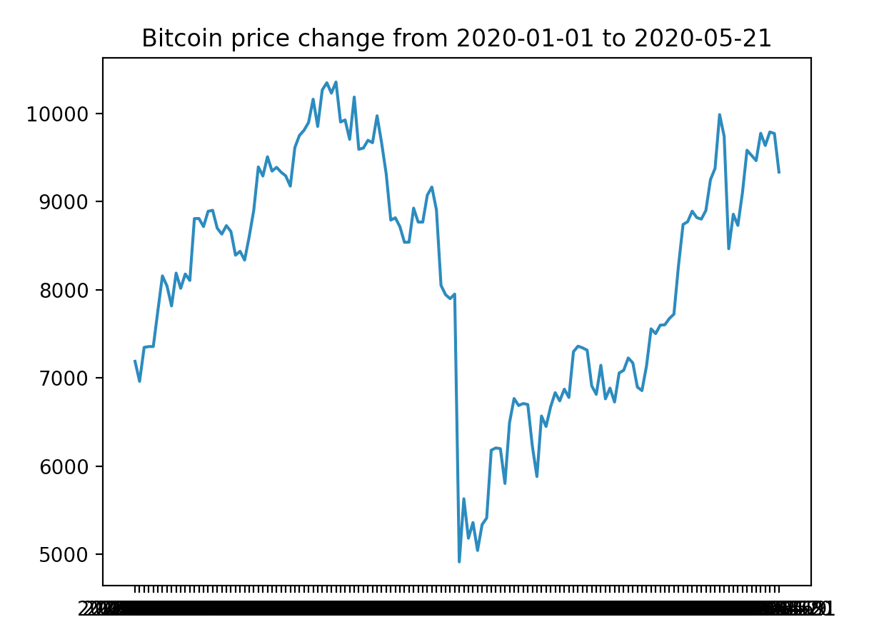

## BITCOIN PRICE PLOT

Read closing price of bitcoin for each day of 2017 from a web API provided by coindesk, then plot the data using matplotlib.



#### INSTALLATION

```console
# pip install requirements.txt
```
